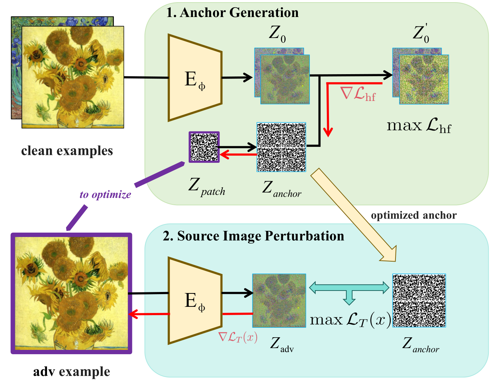
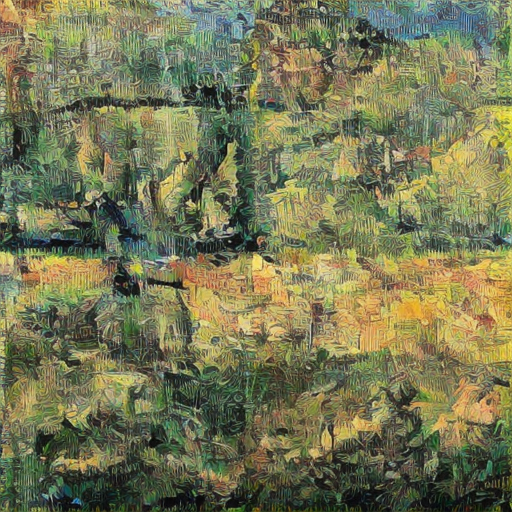
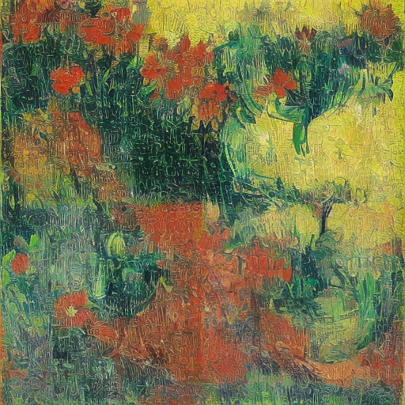
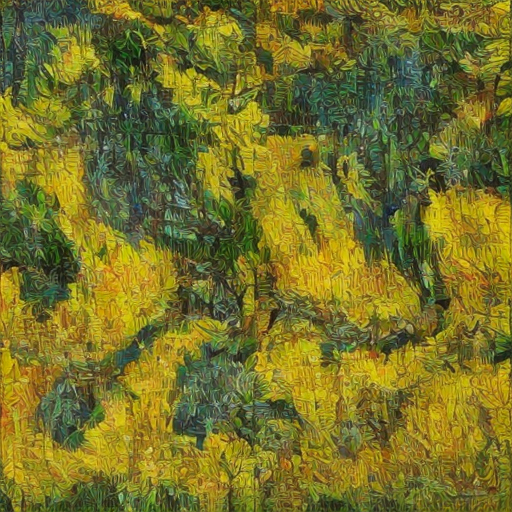

<div align="center">

<h2>QRShield: Exploiting Vulnerabilities of Latent Diffusion Models for Preventing AI
Art Plagiarism [AAAI'2026]</h2>

<strong>
Xunyue Mo, Weibin Wu<sup>*</sup>, Qingrui Tu, Hang Wang, Junxi He, Zibin Zheng
</strong>

<br>

School of Software Engineering, Zhuhai Key Laboratory of Trusted Large Language Models,<br>
Sun Yat-sen University, Zhuhai 519082, China

</div>



The workflow of QRShield. We first optimize the anchor image in the anchor generation stage. We then use
the optimized anchor to perturb the source image.

## Notice
- [11/08/2025] 🎉 Our paper has been accepted to **AAAI 2026**!
- [03/20/2026] 🎉 Our paper is now available in the **AAAI 2026 Proceedings**!
- [03/22/2026] 🚀 The repository is now live!


## Introduction
QRShield is an efficient protection framework against AI art plagiarism, designed to protect artworks from being plagiarized by LDMs (such as Stable Diffusion). This is a minimal reproduction version, suitable for quickly replicating experiments and academic use.


## Setup

Follow these steps to set up the environment:

1. **Download the Pretrained Model:**
   https://huggingface.co/Manojb/stable-diffusion-2-1-base
   Place the downloaded model folder into `data/pretrained_model/`.

2. **Install Dependencies:**
   - Navigate to the `QRShield` directory and run:
     ```bash
     conda create -n QRShield python=3.9 -y
     conda activate QRShield
     pip install -r requirements.txt
     ```

## Quick Run

To generate adversarial examples from clean images using QRShield, follow the steps below (using Vincent van Gogh as an example):

   **Run the Poisoning Script:**
   - Execute the following command in the `QRShield` directory:
     ```bash
     python poisoning.py \
       --pretrained_model data/pretrained_model/stable-diffusion-2-1-base \
       --clean_dir data/artist_data/Vincent_van_Gogh/clean \
       --save_dir data/artist_data/Vincent_van_Gogh/poison
     ```

   **Arguments:**
   - `--pretrained_model`: Path to the downloaded Stable Diffusion 2.1 model folder.
   - `--clean_dir`: Directory containing clean input images (supports `.png`, `.jpg`, `.jpeg`, `.bmp`, `.webp`).
   - `--save_dir`: Directory where adversarial images will be saved.

   ✅ The script will automatically process all images in `clean_dir` and save the adversarial outputs to `save_dir`.


## Evaluation

To evaluate the impact of adversarial samples, we provide a pipeline for full fine-tuning using adversarial examples (using Vincent van Gogh as an example). After fine-tuning, the model can generate new images reflecting the effect of the adversarial perturbations.

   In the `QRShield` directory, run:
   ```bash
   chmod +x evaluate_ff.sh
   ./evaluate_ff.sh
   ```

  > **Note**: Before running, ensure the script uses Unix line endings (`dos2unix evaluate_ff.sh`) and set `ROOT_DIR` to your actual data path.

   The fine-tuned model will be saved under `data/finetuned_model/`.  
   Generated images will be stored in `data/generated_images/`.

**Generate Results:**

The images below were generated by the model after fine-tuning on adversarial samples. They show that the perturbations significantly influence the model’s outputs：

| | | |
|:--:|:--:|:--:|
|  |  |  |
| *"a painting of a bridge over a river by Vincent van Gogh"* | *"a painting of flowers in a pot by Vincent van Gogh"* | *"the wheat field with trees and blue sky by Vincent van Gogh"* |

*Generated images after fine-tuning on adversarial samples*

---

**Testing with Custom Images:**  
To test QRShield with your own images, organize your data following the structure of the Vincent van Gogh example:

- **clean/**: Contains original, clean images (no text captions required).
- **poison/**: Contains adversarial images generated from the clean images(these can be produced using the Quick Run procedure).
- **test/**: Contains text prompts that the fine-tuned model will use to generate new images.

The fine-tuned model will use the prompts in the `test/` directory to generate new images, allowing you to evaluate the effectiveness of the adversarial protection.

## Other Baselines

If you would like to reproduce other baseline methods, please refer to the following repositories:

- **AdvDM / Mist / PhotoGuard / SDS**: https://github.com/xavihart/Diff-Protect
- **Glaze**: https://github.com/AAAAAAsuka/Impress
- **ITA**: https://github.com/psyker-team/mist-v2
- **SimAC**: https://github.com/somuchtome/SimAC
- **Anti-Diffusion**: https://github.com/whulizheng/Anti-Diffusion

## Appendix

For more details on our work, please refer to the supplementary material: [Supplementary Material](data/others/supp.pdf).


## Citation:
If you find our work useful, please cite our paper:

```
@inproceedings{mo2026qrshield,
  title={QRShield: Exploiting Vulnerabilities of Latent Diffusion Models for Preventing AI Art Plagiarism},
  author={Mo, Xunyue and Wu, Weibin and Tu, Qingrui and Wang, Hang and He, Junxi and Zheng, Zibin},
  booktitle={Proceedings of the AAAI Conference on Artificial Intelligence},
  volume={40},
  number={10},
  pages={8098--8106},
  year={2026}
}
```